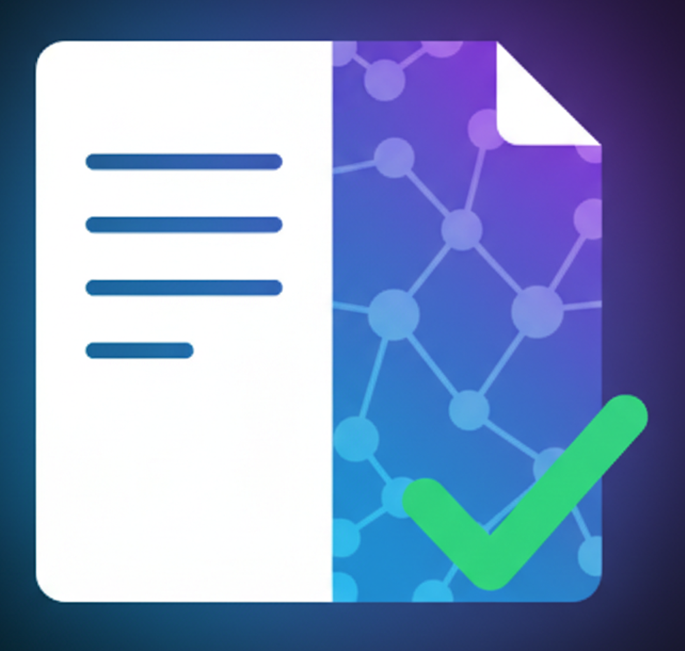

<div align="center" style="margin-bottom: 2rem;">
  
</div>

# doctai
{: .fs-9 }

AI-powered documentation testing
{: .fs-6 .fw-300 }

[Get Started](getting-started.html){: .btn .btn-primary .fs-5 .mb-4 .mb-md-0 .mr-2 }
[View on GitHub](https://github.com/dwertent/doctai){: .btn .fs-5 .mb-4 .mb-md-0 }

---

**Stop wondering if your docs work—know for certain.**

doctai automatically verifies your documentation by reading it with AI, generating test scripts, and executing them.

## Overview

doctai solves a common problem: **outdated or broken documentation**. It uses AI to:

1. **Read** your documentation (setup guides, tutorials, installation instructions)
2. **Understand** what needs to be done through AI analysis
3. **Generate** executable test scripts (bash, python, etc.)
4. **Execute** those scripts to verify everything works
5. **Report** results so you know if your docs are accurate

Perfect for:
- CI/CD pipelines (via GitHub Actions)
- Regular documentation validation
- Testing installation guides
- Verifying tutorials and examples
- Ensuring setup instructions work

## Key Features

- **Multiple AI Providers** - OpenAI, Anthropic (Claude), Google Gemini, or custom endpoints
- **Flexible Configuration** - Config files or command-line arguments
- **GitHub Actions** - Automate testing in CI/CD pipelines
- **Multiple Sources** - Test files, directories, or remote URLs
- **Smart Script Generation** - AI creates executable test scripts
- **Safe Execution** - Isolated environments with timeouts
- **Detailed Reporting** - Clear results with execution logs

## Quick Start

```bash
# 1. Install
pip install doctai

# 2. Create config
cat > .doctai.yml << 'EOF'
docs:
  - README.md
  - docs/installation.md
provider: openai
EOF

# 3. Run
doctai --api-key $OPENAI_API_KEY
```

See [Get Started](getting-started.html) for detailed instructions.

## Documentation

### Getting Started
- [Getting Started](getting-started.html) - Install and run your first test
- [Installation](getting-started/installation.html) - Detailed setup guide

### Guides
- [Configuration](guides/configuration.html) - Config file guide
- [Custom Instructions](guides/instructions.html) - Guide AI behavior
- [Gemini Setup](guides/gemini.html) - Use Google Gemini
- [Features Overview](guides/features.html) - All features explained

### Configuration
- [API Key Configuration](api-key-configuration.html) - Flexible API key setup
- [Generated Scripts](generated-scripts.html) - Inspect generated test scripts

### Reference
- [Architecture](reference/architecture.html) - Technical design
- [Contributing](reference/contributing.html) - Contribution guide
- [Project Overview](reference/project-overview.html) - Complete summary

### Changelog
- [Configuration Feature](changelog/config.html)
- [Gemini Support](changelog/gemini.html)
- [Instructions Feature](changelog/instructions.html)

## 💡 Example Usage

### Basic Usage

```bash
doctai --docs README.md --api-key $OPENAI_API_KEY
```

### With Configuration File

```yaml
# .doctai.yml
docs:
  - README.md
  - docs/installation.md

provider: gemini
model: gemini-1.5-pro-latest

instructions: |
  - Test on Ubuntu 22.04
  - Use Python 3.10+
  - Skip Docker examples
```

```bash
doctai --api-key $GEMINI_API_KEY
```

### In GitHub Actions

```yaml
- name: Test Documentation
  run: doctai --api-key ${{ secrets.OPENAI_API_KEY }}
```

## 🔗 Quick Links

- [GitHub Repository](https://github.com/dwertent/doctai)
- [Report Issues](https://github.com/dwertent/doctai/issues)
- [PyPI Package](https://pypi.org/project/doctai/)

## 🤝 Contributing

We welcome contributions! See our [Contributing Guide](reference/contributing.html) for details.

## 📄 License

MIT License - see [LICENSE](https://github.com/dwertent/doctai/blob/main/LICENSE) for details.

---

**Made with ❤️ for developers who care about documentation quality**

*Version 0.1.0*

